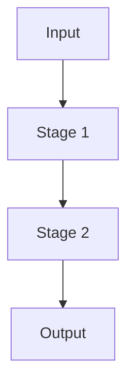

# Cleanup Skill — Reference

## Output Template

Below is the canonical structure for the synthesis report. Copy this structure and fill in the sections.

---

```markdown
# <DIRECTORY_NAME> — Complete Directory Map & Pipeline Architecture

## TL;DR

One paragraph: what this directory is, its primary function, and the pipeline flow.

---

## 1. Directory Topology (The N Layers)

```
~/directory-name/
├── L0: ARCHIVE              archive/              (purpose)
├── L1: COGNITIVE MEMORY     waldo/ + devwater/    (purpose)
...
```

---

## 2. Layer-by-Layer Breakdown

### L0: ARCHIVE — Historical Intelligence
| File | Purpose |
|------|---------|
| `file.md` | One-line summary |

**Signal:** What this layer means to the system.

---

### L1: COGNITIVE MEMORY — Component A + Component B

#### Component A (directory-a/)
| File | Purpose |
|------|---------|
| `spec.md` | Architecture doc |

**Component A reads from:** `path/to/input/`
**Component A writes to:** `path/to/output/`

#### Component B (directory-b/)
| File | Purpose |
|------|---------|
| `hooks/*.sh` | Lifecycle hooks |

**The critical distinction:**
- **Component A** = VISIBLE. What it does, when it runs, audience.
- **Component B** = INVISIBLE. What it does, when it runs, audience.
- **The relationship:** A writes; B reads. A is live; B is review.

---

## 3. The Pipeline Flow (End-to-End)



---

## 4. Database Schema (if applicable)

| Table | Purpose | Key Columns |
|-------|---------|-------------|
| `conversations` | Chat sessions | id, title, model_id |

**Insight:** One sentence about what the database reveals.

---

## 5. Component A vs Component B — The Critical Distinction

| Dimension | Component A | Component B |
|-----------|-------------|-------------|
| Visibility | Visible | Invisible |
| When it runs | On event X | When human opens Y |
| Audience | Machine | Human |

---

## 6. Key Files for Cold Start (Read Order)

1. `START_HERE.md` — Session resumption
2. `BLUEPRINT.md` — System architecture
...

---

## 7. Duplicate & Variant Analysis

| Pattern | Location | Note |
|---------|----------|------|
| `(1)`, `(2)` suffixes | `dir/` | Iterative drafts |

---

## 8. Gaps & Anomalies Detected

1. **Placeholder code** — Remote sync is a no-op
2. **Missing integration** — No vector pipeline wired
...

---

## 9. Decision Points

| Choice | Option A | Option B | Recommendation |
|--------|----------|----------|----------------|
| **Vector ingestion** | Add to hooks | Keep markdown-only | A |

---

## 10. Adjacent Opportunities

1. **Auto-archive drafts** — Script to detect old variants
2. **Graph database migration** — Move JSON graph to Neo4j
...

---

*Mapped using: cleanup skill composing deep-research, project-analyzer, devrything, code-researcher, and data-analyzer.*
```

---

## Condensed Example: peacock-org-docs

For a real-world example of this skill in action, see the output file:
`peacock-org-docs-directory-map.md` (generated during skill authoring).

Key characteristics of that execution:
- **384 files across 42 directories** → mapped into 10 functional layers
- **peacock.db** → full schema extracted and analyzed (11 tables)
- **WALDO vs DevWater** → critical distinction identified and tabled
- **8 gaps detected** → including no-op sync, missing ChromaDB integration, undefined schemas
- **5 decision points** → with recommendations for each

---

## Quick Reference: File Count Command

```bash
find . -type f | sed 's/.*\.//' | sort | uniq -c | sort -rn
```

## Quick Reference: SQLite Schema Extraction

```bash
sqlite3 <file> ".schema"
sqlite3 <file> "SELECT name FROM sqlite_master WHERE type='table';"
```

## Quick Reference: Manifest File Patterns

Priority order for critical files:
1. `START_HERE*`, `README*`, `00-*`
2. `*OVERVIEW*`, `*BLUEPRINT*`, `*ARCHITECTURE*`
3. `*pipeline*manifest*`, `*-pipeline-*.md`
4. `*-spec.md`, `*_SPEC.md`
5. `*_WRITEUP*`, `*_MASTER_*`
6. `BINDING_SPEC*`, `WIRING*`, `*.json` manifests
